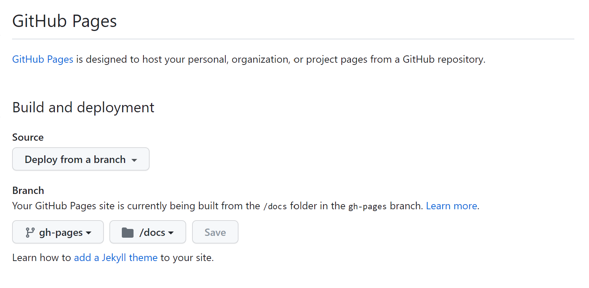

= AsciiDoc Document Sample

== GitHubPagesで公開する

=== gh-pages ブランチの用意

```
git switch main
git switch --orphan gh-pages
```

以下の構成をmainブランチの内容を元に作成する.
```
root
 |-- docs
 |    |-- branches
 |    |    `-- index_template.html
 |    |-- enable_branches_template.json
 |    `-- index.html
 |-- .gitignore
```

gh-pagesブランチへPush
```
git add .
git commit -m "init gh-pages."
git push origin gh-pages
```

=== GitHubPages の設定

GitHubのリポジトリのSettingからPagesの設定を行う. +
公開対象は、「 gh-pages 」ブランチの「 docs 」ディレクトリ配下とすること. +




